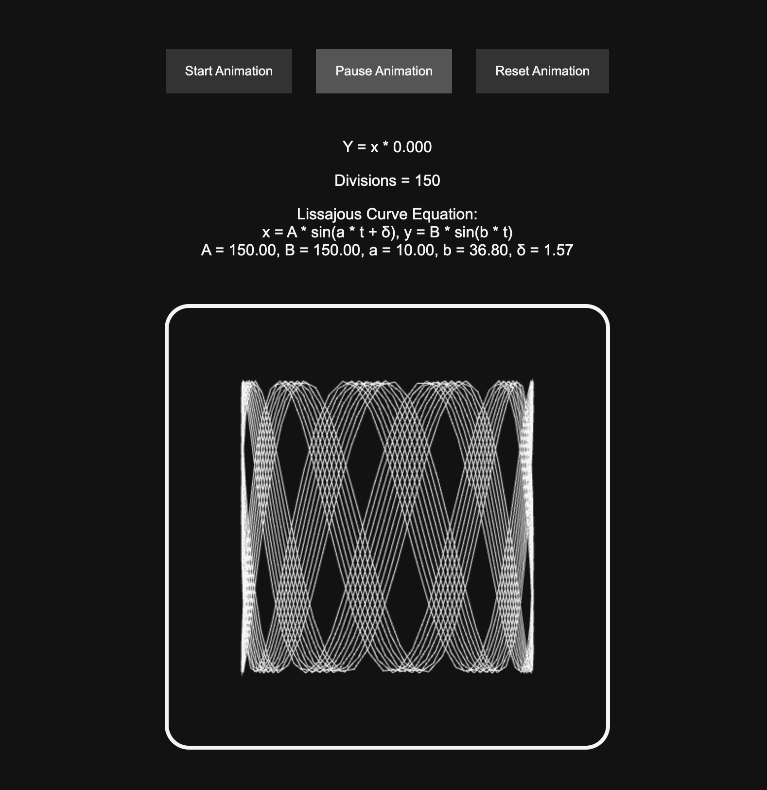

# Dynamic Circle Pattern Animation

## Description
This project creates a visually appealing animation using HTML5 canvas and JavaScript. It features a Lissajous Curve that dynamically changes based on a mathematical equation. The animation is controllable through Start, Pause, and Reset buttons.

## Features
- **Dynamic Animation**: Utilizes the HTML5 canvas for drawing a circular pattern that changes over time.
- **Interactive Controls**: Allows users to start, pause, and reset the animation.
- **Responsive Design**: Adapts to different screen sizes for a consistent user experience.

## Technologies Used
- HTML5
- CSS3
- JavaScript

## How to Run
1. Clone the repository to your local machine.
2. Open the `index.html` file in a web browser to view and interact with the animation.

## Video

https://github.com/jollyzachary/Lissajous-Curve-Animation/assets/129251882/dbf2e335-809e-411c-b43b-26643e9fc75e

## Screenshots

## Contact
- Zachary Jolly - zach.j.jolly@gmail.com

